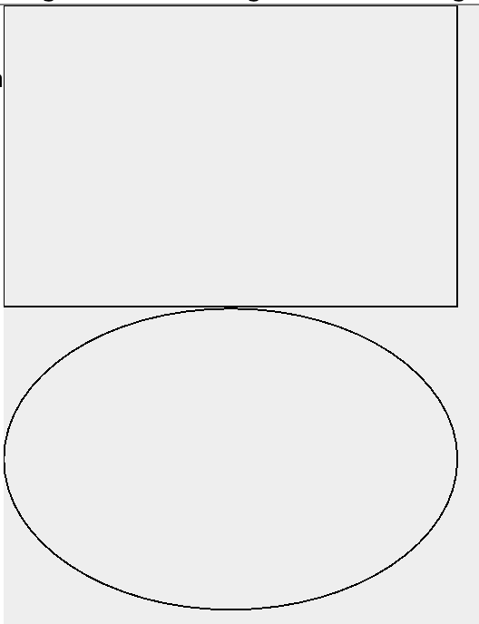
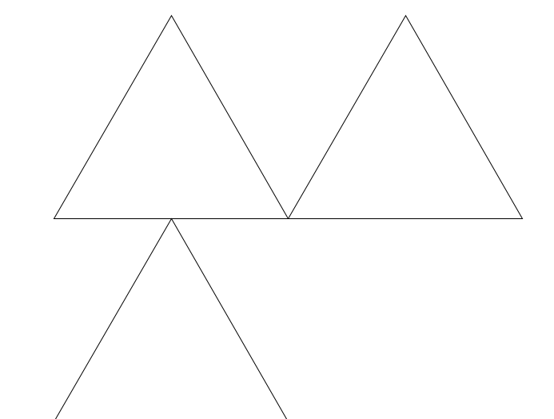
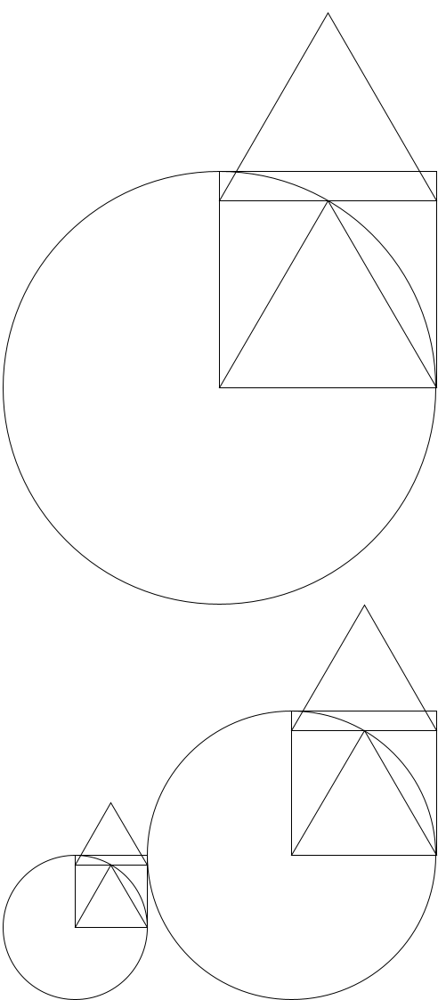
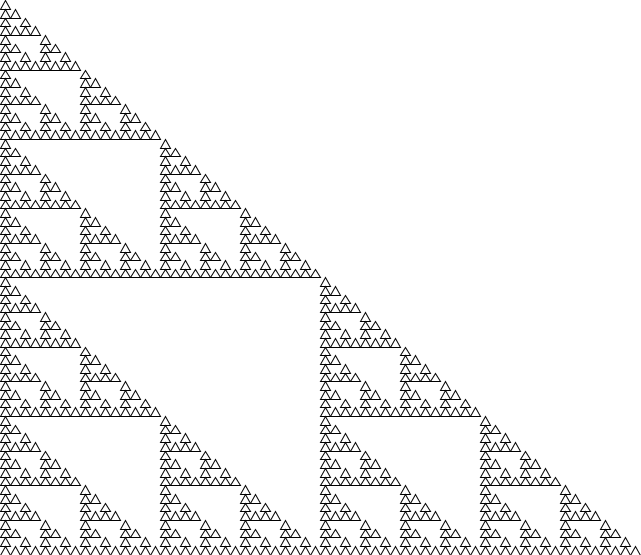
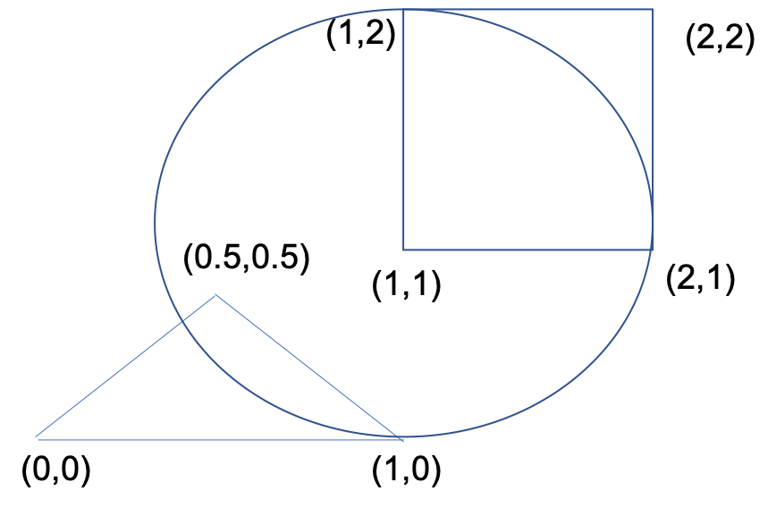
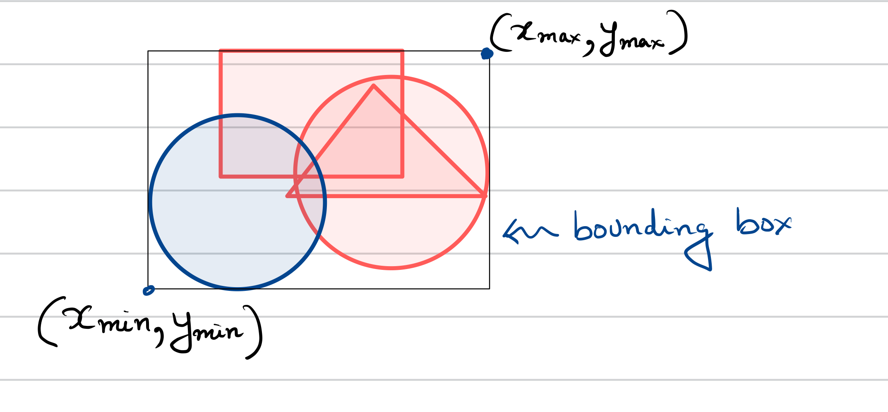
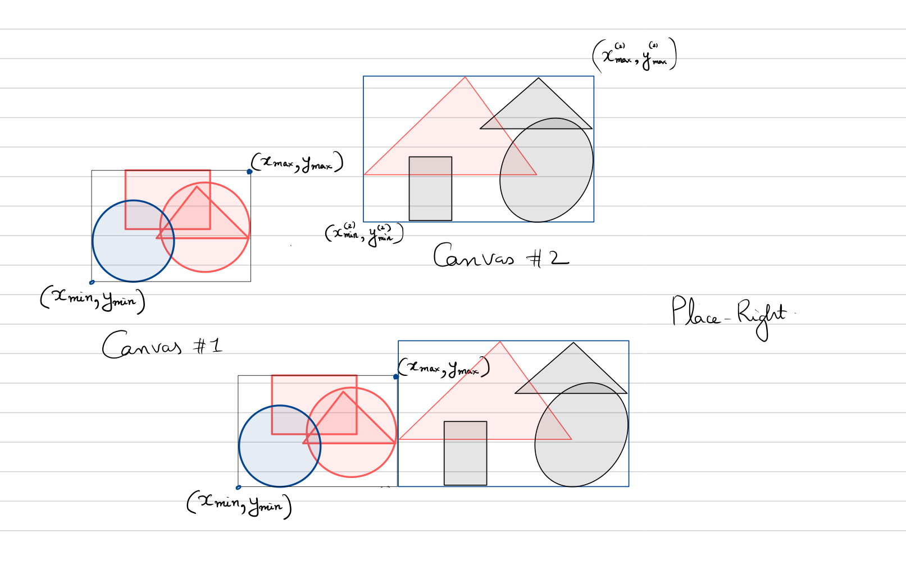
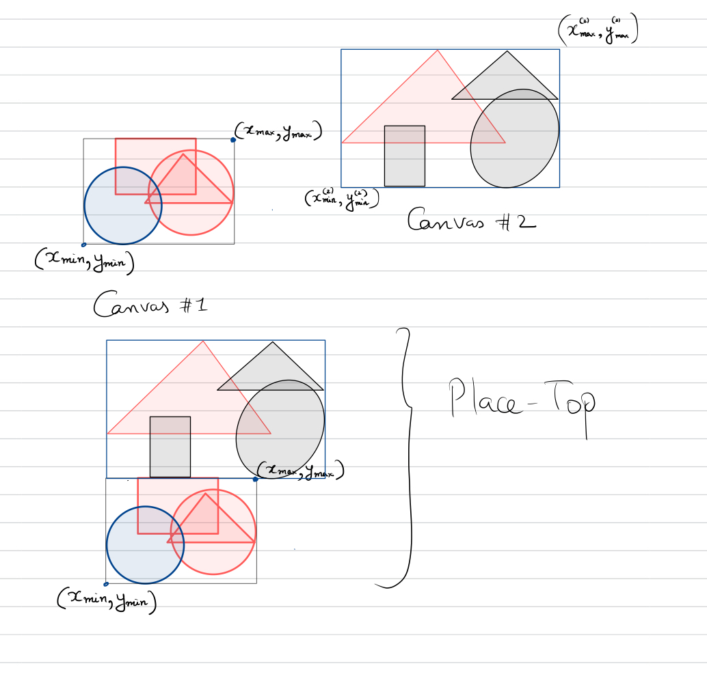

# CSCI 3155: Project 2 (Lettuce With Figs)

This project extends the Lettuce language with arithmetic, let bindings, function calls and recursive functions with an extra value type: _figures_. We will augment the language with operations that can allow us to 
- Draw figures made up of rectangles, lines, triangles and circles.
- Overlay these figures, place them on top of each other and besides each other
- Rotate, Reflect, Translate and Scale these figures. 

Your assigment for this project will include:
- Implement some of the basic operations for the `MyCanvas` data structure (see below).
- Complete the interpreter for this language based on the semantics that are provided.

As previously, you are given some code that includes code we have written for Lettuce with arithmetic and Booleans from the notebooks. Your job is to write the missing code. Please read this documentation properly.

__Beta Notice:__ As always, we make up things as we go along. Please feel free to point out ambiguities/ask for clarifications on piazza.

## Running the code and submitting

Environment setup and submission instructions are the same as for project 1. For your reference, detailed instructions for both testing and submission can be found at the bottom of this document.

__Note:__ By default, you will pass 2 test cases without implementing anything else. This is expected and part of the code that you are given. 

## The Language Extension

We will extend Lettuce to allow us to write programs like this:

```
let a = rectangle(1) in
   let b = circle(0.5) in
      b +^+ a
```

`a` is assigned to a rectangle of side length `1` (it will be a square) and `b` to a circle of radius `0.5`.
Thus `a,b` are of type __Figures__

The operator `+^+` places figure `a` on top of figure `b`.

The result should place a rectangle on top of a circle like thus.

</img>

We will be defining a lot of operators on figures:
  - `f1 ~ f2` : overlay figures `f1` and `f2` on top of each other.
  - `f1 ** d ` : scale a figure by a number `d`
  - `f1 // d` : rotate a figure anticlockwise by angle `d` in radians.
  - `f1 -> [x, y]` : translate a figure by `(x, y)`.
  - `f1 +|+ f2` : place figure `f2` to the right of `f1`
  - `f1 +^+ f2` : place figure `f2` on top of `f1`.
  
What does the program below do?

```
let f1 = triangle(1) in 
  f1 +^+ (f1 +|+ f1)
```

</img>


The `+|+` operator places two triangles one besides other and the `+^+` operator places these on top of new triangle.


The language allows functions as well:

```
let f = function (x) 
      rectangle(x) ~ ((triangle(x) +^+ triangle(x)) ~ circle(x))
      in 
    (f(1) +|+ f(2)) +^+ f(3)
```
Can you try interpreting what figure will be generated by the program above?

</img>

We will also include recursion and now interesting things happen.

```
letrec serp = function (n) function (l)  (
       if (n <= 0)
       then ( triangle(l)+|+triangle(l) ) +^+ ( triangle(l) ) 
       else (
         let t = serp(n-1)(l) in 
            (t +|+ t) +^+ t
      )
 ) in
   serp(5)(10) 
```

</img>


Intrigued? Interested in bringing this language to life? March on forward.


## Part 1. MyCanvas: A value type for representing figures.

We are first going to define a value type called __MyCanvas__ (see file MyCanvas.scala). A canvas is going to collect a bunch of shapes with coordinates. We will define some basic operations on canvases:
- creating a canvas with a single shape.
- bounding box for a canvas.
- overlap of two canvases.
- placing one canvas on top of another to yield a new canvas.
- placing one canvas to the left of another to yield a new canvas.
- rotation of a canvas.

$$\newcommand\MyCanvas{\texttt{MyCanvas}}$$
A canvas is  of the form  $\MyCanvas(\{o_1, \ldots, o_n\})$, wherein $o_1, \ldots, o_n$ are the objects in the canvas.
Each object $o_i$ is itself one of the following: 
- $Polygon(\{ (x_0, y_0), \ldots, (x_{k-1}, y_{k-1}) \})$: A polygon whose vertex coordinates are specified.
- $Circle( (x_c, y_c), r) $: A circle with the specified center $(x_c, y_c)$ and radius.


### Example of Canvas

Consider a canvas 

```
MyCanvas ( { 
    Polygon( { (0,0), (1,0), (0.5,0.5) } ) , 
    Circle ( (1,1), 1) , 
    Polygon( { (1,1), (2,1), (2,2), (1,2) }  ) 
    } ) 
```


</img>


Canvases are going to be a value type for our interpreter along with numbers, booleans, closures and (nominally) error.


##  Operations on canvas.

### Bounding Box of a canvas.

A bounding box for a canvas $c$ is given by $\texttt{boundingBox}(c)$ which 
is a tuple of $4$ numbers of the form $(x_{\min}, x_{\max}, y_{\min}, y_{\max})$ where 
- $x_{min}$ is the smallest $x$ coordinate for any object in the canvas.
- $x_{max}$ is the largest $x$ coordinate for any object in the canvas.
- $y_{min}$ is the smallest $y$ coordinate for any object in the canvas.
- $y_{max}$ is the largest $y$ corrdinate for any object in the canvas.

 </img>

Once again consider the example canvas from before:

```
MyCanvas ( { 
    Polygon( { (0,0), (1,0), (0.5,0.5) } ) , 
    Circle ( (1,1), 1) , 
    Polygon( { (1,1), (2,1), (2,2), (1,2) }  ) 
    } ) 
```

Its bounding box is given by $(0, 2, 0, 2)$ with $x_{\min}= y_{\min} = 0$ and $x_{\max} = y_{\max} = 2$.

### Translate operation on a canvas

Given a Canvas object $c$ , its translation by $(xShift, yShift)$ 
is denoted $\texttt{translate}(c, xShift, yShift)$ and yields a new canvas.

The translate operation adds the value `xShift` to all x coordinates of the
object in the canvas and `yShift` to all y coordinates of the object in the canvas.

Once again consider the example canvas from before:
```
MyCanvas ( { 
    Polygon( { (0,0), (1,0), (0.5,0.5) } ) , 
    Circle ( (1,1), 1) , 
    Polygon( { (1,1), (2,1), (2,2), (1,2) }  ) 
    } ) 
```

We wish to perform a translation by $(2,3)$ where xShift = 2 and yShift = 3.
The result will be the canvas.

```
MyCanvas ( { 
    Polygon( { (2,3), (3,3), (2.5,3.5) } ) , 
    Circle ( (3,4), 1) , 
    Polygon( { (3,4), (4,4), (4,5), (3,5) }  ) 
    } ) 
```

### Rotation Operation on a canvas.

Given a Canvas object $c$ , its rotation by $\theta$ in radians 
is denoted $\texttt{rotate}(c, \theta)$ and yields a new canvas.


Recall from your calculus class that rotating a point $(x,y)$ by angle $\theta$ in radians yields

$ x' = x \cos(\theta) - y \sin(\theta),\ \ \ y' = x\sin(\theta)  + y\cos(\theta)$

As an example, let us rotate the canvas from before:
```
MyCanvas ( { 
    Polygon( { (0,0), (1,0), (0.5,0.5) } ) , 
    Circle ( (1,1), 1) , 
    Polygon( { (1,1), (2,1), (2,2), (1,2) }  ) 
    } ) 
```

by $30^{\circ}$ or $\frac{\pi}{6}$ radians. 

Rotating a canvas is given by rotating each object in the canvas.
- Rotating a polygon is given by applying rotation by $\theta$ to each vertex
- Rotating a circle is given by applying rotation by $\theta$ to the center of the circle. Radius is unchanged.


### Overlapping one canvas with other.

Let $c1: \texttt{MyCanvas}(O_1)$ with objects in set $O_1$ and likewise $c_2: \texttt{MyCanvas}(O_2)$. We define
the canvas

$\texttt{overlap}(c1, c2) = \texttt{MyCanvas}(O_1 \cup O_2)$

The new canvas has objects which are simply the union of objects from canvases c1 and c2.


### Placing one canvas to the right of another

The `placeRight` operator will place one canvas to the right of another. Let us consider the operation of 
placing canvas `c2` to the right of canvas `c1`. To achieve this, we are going to first
- translate the objects in canvas `c2` by a `shiftX` and `shiftY` that we will compute.
- next we will make a new canvas that combines the objects in both.

</img>

Note that place right will does not change canvas `c1` but will shift canvas `c2` such that : 
  - It's left boundary matches the right boundary of canvas `c1`.
  - It's bottom boundary matches that of canvas `c1`.


Formally, let $c_1: \MyCanvas(O_1)$ and $c_2: \MyCanvas(O_2)$ be the two canvases. The operation 
$\texttt{placeRight}(c_1, c_2)$ is defined as follows:

- Let $(x_{\min,1}, x_{\max,1}, y_{\min,1}, y_{\max,1})$ be the result of $\texttt{boundingBox}(c_1)$.
- Let $\color{blue}{(x_{\min,2}, x_{\max,2}, y_{\min,2}, y_{\max,2})}$ be the result of $\texttt{boundingBox}(c_2)$.
- Define $xShift = (x_{\max,1} - \color{blue}{x_{\min,2}})$. Shifting $c_2$ by this $x$ coordinate will align the new value of $x_{\min,2}$ with $x_{\max,1}$.
- Define $yShift = (y_{\min, 1} - \color{blue}{y_{\min,2}} ) $. Shifting $c_2$ by this $y$ coordinate will align the new value of $y_{\min,2}$ with $y_{\min,1}$.
- Let $\color{red}{\hat{c}_2}$ be the canvas obtained by $\texttt{translate}(c_2, xShift, yShift) $
- Define the result of $\texttt{placeRight}(c_1, c_2) = \texttt{overlap}(c_1, \color{red}{\hat{c}_2}) $.


### Placing one canvas on top of another

The `placeTop` operator will place one canvas on top of another. Let us consider the operation of 
placing canvas `c2` on top of canvas `c1` and making sure that their leftmost boundaries align.
To achieve this, we are going to first
- translate the objects in canvas `c2` by a `shiftX` and `shiftY` that we will compute.
- next we will make a new canvas that combines the objects in both.


 </img>

Let $c_1: \MyCanvas(O_1)$ and $c_2: \MyCanvas(O_2)$ be the two canvases. The operation 
$\texttt{placeTop}(c_1, c_2)$ is defined as follows:

- Let $(x_{\min,1}, x_{\max,1}, y_{\min,1}, y_{\max,1})$ be the result of $\texttt{boundingBox}(c_1)$.
- Let $\color{blue}{(x_{\min,2}, x_{\max,2}, y_{\min,2}, y_{\max,2})}$ be the result of $\texttt{boundingBox}(c_2)$.
- Define $xShift = (x_{\min,1} - \color{blue}{x_{\min,2}})$. 
- Define $yShift = ( y_{\max,1} - \color{blue}{y_{\min,2}})$.
- Let $\color{red}{\hat{c}_2}$ be the canvas obtained by $\texttt{translate}(c_2, xShift, yShift) $
- Define the result of $\texttt{placeTop}(c_1, c_2) = \texttt{overlap}(c_1, \color{red}{\hat{c}_2}) $.

The calculations above can be easily justified if you look at the figure above.


### Reflecting a canvas about $x$-axis

Reflection about $x$-axis transforms a point $(x, y)$ as $(x, -y)$. Thus, we will first define reflections for 
the basic figures: Circles and Polygon.
  - Reflection of a circle with center $(c_x, c_y)$ and radius $r$ about $x-$ axis is given by a circle with center $(c_x, -c_y)$ and radius $r$.
  - Reflection of a polygon with list of coordinates $(x_1, y_1), \ldots, (x_k, y_k)$ is itself a polygon with coordinates $(x_1, -y_1), \ldots, (x_k, -y_k)$.
  
For a canvas $\MyCanvas(o_1, \ldots, o_n)$ with figures $o_1, \ldots, o_n$, its reflection is obtained by reflecting the individual figures in it.

### Reflecting about $y$-axis

Reflection about $y$-axis transforms a point $(x, y)$ as $(-x, y)$. The rest is very similar to the case of reflection about $x$-axis.

### Scaling a canvas

Given a canvas $\MyCanvas(o_1, \ldots, o_n)$ and a scale factor $s$ (may be positive or negative), the scaling 
of canvas w.r.t. $s$ is given by transforming every coordinate $(x, y)$ as $(s * x, s * y)$. 

Once again, we define scaling for individual figures: 
- Scaling a circle with center $c_x, c_y$ and radius $r$ is given by a new circle with center $(s*c_x, s*c_y)$ 
and radius $|s * r|$ -- note that radius of a circle must be non-negative.
- Scaling a polygon with vertices $(x_1, y_1), \ldots, (x_k, y_k)$ is given by a new polygon with vertices
$(s x_1, s y_1), \ldots, (s x_n, s y_n)$.

Scaling $\MyCanvas(o_1, \ldots, o_n)$ results in a new $\MyCanvas$ whose figures are obtained by scaling $o_1, \ldots, o_n$ each by the scale factor $s$.


## Task 1

Implement the canvas operations using the data structures defined in the file `MyCanvas.scala`.
Please follow the given scheme and do not modify existing code.

Your results must pass the unit tests provided under `CanvasTests`

# Part 2: Interpreting Lettuce With Figs.

## Abstract Syntax of LettuceWithFig

We will have the following abstract syntax borrowed from the language with recursive calls. Note that the key 
extensions are shown in red.

$$\newcommand\nt[1]{\mathbf{#1}}$$

A program is simply a expression wrapped around the _TopLevel_ constructor.

$$\begin{array}{rcl}
\nt{Program} & \rightarrow & TopLevel(\nt{Expr}) \\
\end{array}$$

Expressions are given as follows:

$$\begin{array}{rcll}
\nt{Expr} & \rightarrow & Const(\nt{Double}) \\
& \rightarrow  & ConstBool(\nt{Boolean}) \\
& \rightarrow & Ident(\nt{String}) \\ \\
& \rightarrow & \color{red}{Rectangle(\nt{Expr})}  & \text{Creation of Basic Shapes for Figures} \\
& \rightarrow & \color{red}{EquiTriangle(\nt{Expr})} \\
& \rightarrow & \color{red}{Circle(\nt{Expr})} \\
& \rightarrow & \color{red}{HLine(\nt{Expr})} \\ 
& \rightarrow & \color{red}{VLine(\nt{Expr})} \\ \\
&& & \text{Operations on Figures} \\
& \rightarrow & \color{red}{Overlay(\nt{Expr}, \nt{Expr}) }& \text{overlay one figure on top of another}\\
& \rightarrow & \color{red}{Rotate(\nt{Expr}, \nt{Expr})} & \text{rotate a figure expression by an angle (numeric expression)} \\
& \rightarrow & \color{red}{HConcat(\nt{Expr}, \nt{Expr})} & \text{place the second figure to the right of the first (see semantics)} \\
& \rightarrow & \color{red}{VConcat(\nt{Expr}, \nt{Expr})} & \text{place second figure on top of the first (see semantics)} \\
& \rightarrow & \color{red}{ReflectX(\nt{Expr})} & \text{reflect a figure about the x-axis} \\
& \rightarrow & \color{red}{ReflectY(\nt{Expr}) } & \text{reflect a figure about the y-axis} \\
& \rightarrow & \color{red}{Scale(\nt{Expr}, \nt{Expr})} & \text{scale a figure by a numeric expression} \\
& \rightarrow & \color{red}{Translate(\nt{Expr}, \nt{Expr})} & \text{translate a figure (first argument) by a coordinate (second argument)} \\
&& \\
& & & \text{define coordinates as pairs} \\ 
& \rightarrow & \color{red}{Pair(\nt{Expr}, \nt{Expr})} & \text{construct a pair from two expressions } \\ 
& \rightarrow & \color{red}{PairFirst(\nt{Expr})}& \text{extract first element from a pair } \\  
& \rightarrow & \color{red}{PairSecond(\nt{Expr})} & \text{extract second element from a pair} \\\\ 
& \rightarrow & Plus(\nt{Expr}, \nt{Expr}) & \text{Arithmetic Operators}\\
& \rightarrow & Minus(\nt{Expr}, \nt{Expr}) \\
& \rightarrow & Mult(\nt{Expr}, \nt{Expr}) \\
& \rightarrow & Div(\nt{Expr}, \nt{Expr}) \\
&& \\
& \rightarrow & Geq(\nt{Expr}, \nt{Expr}) \\
& \rightarrow & Gt(\nt{Expr}, \nt{Expr} ) \\
& \rightarrow & Eq(\nt{Expr}, \nt{Expr}) \\
& \rightarrow & Neq(\nt{Expr}, \nt{Expr}) \\
& \rightarrow & And(\nt{Expr}, \nt{Expr}) \\
& \rightarrow & Or(\nt{Expr}, \nt{Expr}) \\
& \rightarrow & Not(\nt{Expr})\\ \\
    & \rightarrow & IfThenElse(\nt{Expr}, \nt{Expr}, \nt{Expr})\\\\
& \rightarrow & Let(\nt{String}, \nt{Expr}, \nt{Expr}) & \text{let bindings}\\
& \rightarrow & LetRec(\nt{String}, \nt{String}, \nt{Expr}, \nt{Expr}) & \text{recursive definition} \\
& \rightarrow & FunDef(\nt{String}, \nt{Expr}) & \text{anonymous function}\\
& \rightarrow & FunCall(\nt{Expr}, \nt{Expr}) & \text{function call}\\
\end{array}$$

We will interpret our language now. We will have the following value types:
- NumValue(Double)
- BoolValue(Boolean)
- Closure(String, Expression, Environment)
- PairValue(Value, Value)
- FigValue(Canvas)
- Error 

Note that we will not really consider error and just throw an exception whenever we encounter error.

For your convenience the operations over values are defined in the file `Value.scala`. Notice some 
refactoring is happening to help out with implementing the operator.

- You may want to modify the functions
- ValueOps.plus, ValueOps.mult, ValueOps.divide, ValueOps.minus and so on.

The semantics of Lettuce with Figs are going to inherit all the existing semantic rules used for handling
- arithmetic
- booleans
- comparisons
- function calls
- let bindings
- recursion

The additional rules need to deal with operations over figures. We provide these rules below.

### Semantics of Figs.
The first few rules specify the creation of basic figures.

$\newcommand\semRule[3]{\begin{array}{c} #1 \\ \hline #2 \\ \end{array}\ \ (\text{#3})}$
$\newcommand\reals{\mathbb{R}}$
$\newcommand\evalExpr{\mathsf{evalExpr}}$

The rule for a rectangle is as follows:

$\semRule{ \evalExpr(e, \sigma) = v, \ v \in \reals } { \evalExpr(\texttt{Rectangle(e)}, \sigma) = Canvas(\{ Polygon( \{ (0,0), (0,v), (v,v), (v,0) \} ) \}) }{rectangle-ok}$

The rule tells us how to create a rectangle whose side length is given by the expression `e`. 
The error rules for this is simple and left to the reader.

The rule for an equilateral triangle is as follows:

$\semRule{ \evalExpr(e, \sigma) = v, \ v \in \reals } { \evalExpr(\texttt{EquiTriangle(e)}, \sigma) = Canvas(\left\{ Polygon( \left\{ (0,0), (v,0), \left(\frac{v}{2}, \frac{\sqrt{3}v}{2}\right) \right\} ) \right\}) }{triangle-ok}$

Note that the vertex $(\frac{v}{2}, \frac{\sqrt{3}v}{2})$ ensures that the triangle is equilateral.

The rules for a circle and line are as follows:

$\semRule{ \evalExpr(e, \sigma) = v, \ v \in \reals } { \evalExpr(\texttt{Circle(e)}, \sigma) = Canvas(\{ Circle((0,0), v) \}) }{circle-ok}$

$\semRule{ \evalExpr(e, \sigma) = v, \ v \in \reals } { \evalExpr(\texttt{HLine(e)}, \sigma) = Canvas(\{ Polygon (\{ (0,0), (v,0) \}) \}) }{hline-ok}$


$\semRule{ \evalExpr(e, \sigma) = v, \ v \in \reals } { \evalExpr(\texttt{VLine(e)}, \sigma) = Canvas(\{ Polygon (\{ (0,0), (0,v) \}) \}) }{vline-ok}$


The rule for error is simple:

$\semRule{ \evalExpr(e, \sigma) = v, \ \color{red}{v \not\in \reals}, \ \texttt{T} \in \{\texttt{HLine}, \texttt{VLine},\texttt{Circle}, \texttt{Rectangle}, \texttt{Triangle}\} } { \evalExpr(\texttt{T(e)}, \sigma) = \mathbf{error} }{basic-shape-error}$


### Operators on Figures

We will talk about the semantics of operators on figures. 

### Overlay


$\semRule{\evalExpr(\texttt{e1}, \sigma) = v_1,\ v_1 = Canvas(O_1)\  \evalExpr(\texttt{e2}, \sigma) = v_2,\ v_2 = Canvas(O_2)}{\evalExpr(\texttt{Overlay(e1, e2)}, \sigma) = \texttt{overlap}(v_1, v_2) }{overlay-figures-ok}$

We are not writing all the error rules. But note that overlaying combination of values other than two figures results in an error.

### HConcat

$\semRule{\evalExpr(\texttt{e1}, \sigma) = v_1,\ v_1 = Canvas(O_1)\  \evalExpr(\texttt{e2}, \sigma) = v_2,\ v_2 = Canvas(O_2)}{\evalExpr(\texttt{HConcat(e1, e2)}, \sigma) = \texttt{placeRight}(v_1, v_2) }{hconcat-figures-ok}$

__Note__ Place the figure generated by `e2` to the right of that generated by `e1`.


Similarly we are skipping error rules but these would involve trying to apply `HConcat` to non-figures.


### VConcat


$\semRule{\evalExpr(\texttt{e1}, \sigma) = v_1,\ v_1 = Canvas(O_1)\  \evalExpr(\texttt{e2}, \sigma) = v_2,\ v_2 = Canvas(O_2)}{\evalExpr(\texttt{VConcat(e1, e2)}, \sigma) = \texttt{placeTop}(v_1, v_2) }{vconcat-figures-ok}$

__Note__ Place the figure generated by `e1` on top of that generated by `e2`.

### Scale 


$\semRule{\evalExpr(\texttt{e1}, \sigma) = f,\ f = Canvas(O_1)\  \evalExpr(\texttt{e2}, \sigma) = s, s \in R}{\evalExpr(\texttt{Scale(e1, e2)}, \sigma) = \texttt{scale}(f, s) }{scale-ok}$

__Note__ Scale the figure generated by `e1` by the number signified by expression `e2`.

### ReflectX, ReflectY


$\semRule{\evalExpr(\texttt{e}, \sigma) = f,\ f = Canvas(O_1)}{\evalExpr(\texttt{ReflectX(e)}, \sigma) = \texttt{reflect-x}(f) }{reflect-x-ok}$


$\semRule{\evalExpr(\texttt{e}, \sigma) = f,\ f = Canvas(O_1)}{\evalExpr(\texttt{ReflectY(e)}, \sigma) = \texttt{reflect-y}(f) }{reflect-y-ok}$


### Translate

$\semRule{\evalExpr(\texttt{e1}, \sigma) = f,\ f = Canvas(O_1)\  \evalExpr(\texttt{e2}, \sigma) = (v_1, v_2), v_1, v_2 \in R}{\evalExpr(\texttt{Translate(e1, e2)}, \sigma) = \texttt{shift}(f, (v_1, v_2)) }{translate-ok}$

Note that the second argument of translate must be a pair of numbers representing a coorddinate.

### Rotate

$\semRule{\evalExpr(\texttt{e1}, \sigma) = f_1,\ f_1 = Canvas(O_1)\  \evalExpr(\texttt{e2}, \sigma) = v_2,\ v_2 \in \reals}{\evalExpr(\texttt{Rotate(e1, e2)}, \sigma) = \texttt{rotate}(f_1, v_2) }{rotate-figure-number}$

__Note__ Rotate the figure generated by `e1` using the angle in radians that expression `e2` evaluates to.


## Operations on Pairs

Note that we have a new datatype consisting of a pair of values introduced to enable coordinates (pairs of numerical values).

We will use value type `PairValue` to represent pairs.

### Pair up two expressions

$\semRule{\evalExpr(\texttt{e1}, \sigma) = v_1,\ v_1 \not= \mathsf{error}\  \evalExpr(\texttt{e2}, \sigma) = v_2,\ v_2\not= \mathsf{error}}{\evalExpr(\texttt{Pair(e1, e2)}, \sigma) = (v_1, v_2) }{pair}$

### First/second

$\semRule{\evalExpr(\texttt{e}, \sigma) = v,\ v = (v_1, v_2)}{\evalExpr(\texttt{First(e)}, \sigma) = v_1 }{first}$


$\semRule{\evalExpr(\texttt{e}, \sigma) = v,\ v = (v_1, v_2)}{\evalExpr(\texttt{Second(e)}, \sigma) = v_2 }{second}$


## Rule for Other Operations

The rules for the other operations, let bindings, function definitions, function calls and recursion remain unchanged.

## Task 2: Write the Interpreter

Your job is to fill in the missing code for the interpreter. 

The interpreter is defined in the file `Interpreter.scala`. 

The value types are in `Value.scala`

The environment (for handling recursion as well) is defined in `Environment.scala`.

You can throw an `IllegalArgumentException` whenever you encounter an error. A string message should be 
added to the exception to indicate why you fail.

### Test Cases

We have two suites of test cases for this task. 
  - Complete the interpreter and  run `OperatorTests`
  - Finally, run `InterpreterTests`.
  
These are not all: we will have hidden test cases to evaluate your code. It is useful for you to write your own tests for your own code.

## Trying out test programs 

Besides test cases, the directory `tests/` has ten test programs we have written along with the expected output as png files. 

To run these use the following command run in the terminal from the main directory.

`sbt "runMain edu.colorado.csci3155.project2.ParserTest tests/test8.fg output.png" `

The command above will run the program `test8.fg` under directory tests and output the result to `output.png`.
Compare what you got with the reference image `tests/test8.png`.

## Instructions for Testing.

#### Command line: sbt

You can run Main from the command prompt with the current directory as the very top directory of the project,
by running the following commands:

```bash
$ sbt compile
$ sbt test
```

### Running ScalaTest tests

Also, we will use a powerful unit testing package called scalatest. The tests themselves are in two files in the
directory
`src/test/scala/edu/colorado/csci3155/project1/`

There are tests in there for both the compiler and emulator implementations.

#### VSCode

Type `test` in the SBT terminal. It will provide all tests that passed and tests that failed.

#### sbt

To run this go to the terminal and from the very top directory run:

```bash
$ sbt test
```

It will say success if all tests run or give you a failure messages.

## Instructions for submission

1. Ensure everything is saved.
2. Run the tests one last time to ensure everything works as expected.
    * You will not be able to submit if your code does not at least compile.
3. Push your latest commit to your Github Classroom repo for this assignment.
    * The auto-grader will run, and you should see your score reflect how many of the tests your solution passes. To learn more on how to check your grade, read [this](https://github.com/csci3155-sp24/.github/blob/main/profile/README.md).
4. Run the `checkAndZipSubmission` sbt task following one of the options below:
    * (*Terminal*) Run `sbt checkAndZipSubmission` in a terminal
    * (*SBT Shell*) Type `checkAndZipSubmission` on the command prompt for SBT shell.
    * If none of the above works, place the following scala files in a zip file called `submission.zip`. Please make
      sure that the zip file has just these two scala files and nothing else.
        * StackMachineCompiler.scala
        * StackMachineEmulator.scala

5. Upload the generated `submission.zip` file.

__Do not__ try to upload your entire directory or all the source files.
If you are having trouble with this, talk to the TA or instructor first.

Failure to submit the right files may incur a penalty.

# That's All Folks